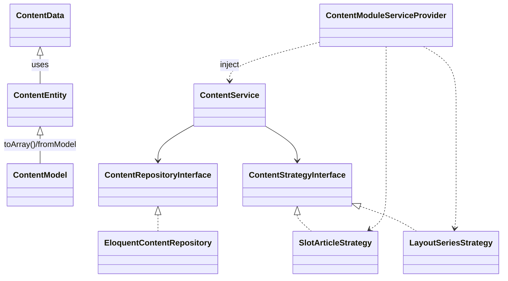
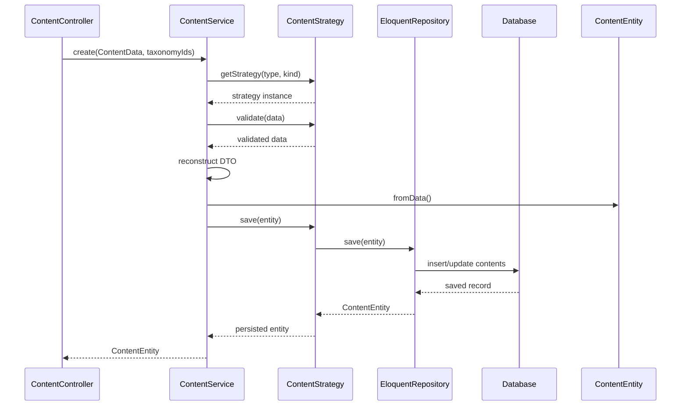

# ContentModule

## Overview
`ContentModule` は汎用的なコンテンツ管理基盤を提供するLaravelモジュールです。`TYPE`（表示位置）と`KIND`（コンテンツ構造）を組み合わせた戦略的な保存・レンダリング機能を特徴としています。

### 主なコンポーネント
- **Migration**: `contents`テーブルを定義（`content_type`／`content_kind`／`body`／`meta`／`status` など）
- **DTO**: `ContentData`（`fromArray()`／`toArray()` を備える）
- **Entity**: `ContentEntity`（DTO をラップし、ファクトリ／ゲッターを提供）
- **Eloquent Model**: `ContentModel`（テーブルマッピングとキャスト設定）
- **Repository**: `ContentRepositoryInterface` / `EloquentContentRepository`
- **Service**: `ContentService`（戦略の解決とビジネスロジック）
- **Strategy**: `ContentStrategyInterface` と具体実装 (`SlotArticleStrategy`, `LayoutSeriesStrategy`, ...)
- **ServiceProvider**: `ContentModuleServiceProvider`（DIバインド／タグ登録／ビュー読み込み）

## Class Diagram


## Sequence Diagram (コンテンツ作成の流れ)


## Installation
1. `composer require your-vendor/content-module`
2. `php artisan vendor:publish --provider="Modules\ContentModule\Infrastructure\Providers\ContentModuleServiceProvider"`
3. `php artisan migrate`

## Usage

### 管理画面での操作フロー
1. **TYPE タブ**：表示位置（slot, layout, static, system）を切り替えて一覧を取得
2. **KIND フィルタ**：コンテンツ構造（article, series, collection, guidebook）で絞り込み
3. **新規作成**：フォームに必要項目を入力し「保存」をクリック

### Blade コンポーネントの利用例
```blade
{{-- フッター右端に "series" コンテンツ（key: footer_1）を表示 --}}
<x-content-slot key="footer_1" kind="series" />
```

### プログラムからの利用例（コントローラ）
```php
use Modules\ContentModule\Application\Services\ContentService;
use Modules\ContentModule\Application\DTOs\ContentData;

public function store(ContentService $service)
{
    $data = ContentData::fromArray([
        'site_id'      => 1,
        'title'        => '新着記事',
        'slug'         => 'new-article',
        'content_type' => 'slot',
        'content_kind' => 'article',
        'body'         => '記事本文',
        'meta'         => ['order' => 1],
        'status'       => 'published',
        'published_at' => now()->format('Y-m-d H:i:s'),
    ]);

    $entity = $service->create($data, []);

    return redirect()->route('content.index')
                     ->with('status', 'コンテンツを作成しました: ' . $entity->getTitle());
}
```

---


