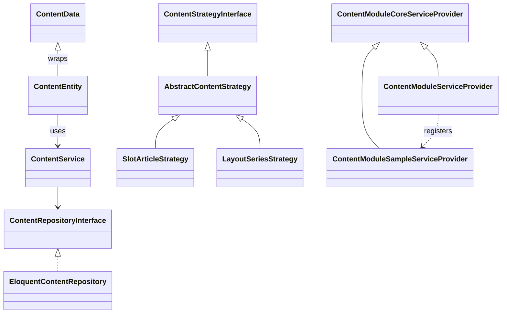
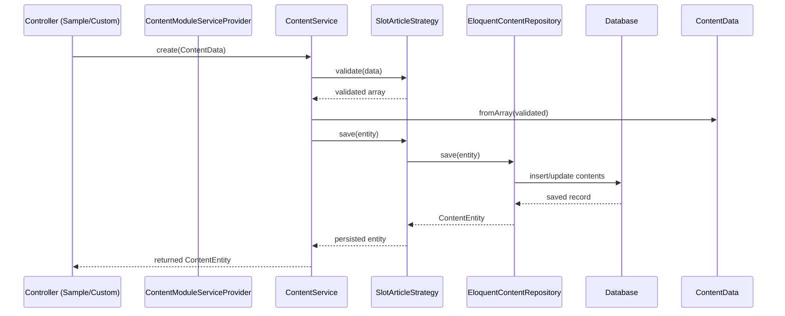

# ContentModule

## 概要

`ContentModule` は、Laravel 向けに汎用的かつ拡張性の高いコンテンツ管理基盤を提供するモジュールです。

* **TYPE（表示軸） × KIND（構造軸）** による戦略的な保存・レンダリング
* **メタスキーマ** による柔軟なフィールド定義
* **Symfony Workflow** を用いた状態管理（ワークフロー）
* **マイグレーションスタブ** で必要なテーブルだけを公開可能
* **Core / Samples / Custom** の３層構成で、拡張とメンテナンスを両立

## 特徴

| 機能             | 説明                                                                                                      |
| -------------- | ------------------------------------------------------------------------------------------------------- |
| TYPE × KIND 戦略 | 表示位置（slot, layout, static, system）と構造（article, series, collection, guidebook）を組み合わせ、各コンテンツの振る舞いを拡張できます。 |
| メタスキーマ         | フィールド定義とバリデーションを `config/meta_schema.php` で管理し、同一 TYPE・KIND でも可変な入力項目を実現。                               |
| ワークフロー制御       | 下書き → レビュー → 公開 → アーカイブなどの状態遷移を `config/workflow.php` で定義し、Symfony Workflow により自動適用します。                 |
| マイグレーションスタブ    | `database/stubs/` 配下のファイルを `vendor:publish` → `migrate` でコピー・実行し、必要なテーブルだけを作成できます。                      |
| 三層構成           | **Core**：ドメイン・ユースケース／**Samples**：サンプル機能一式／**Custom**：公開スタブ・設定ファイルを分離。                                   |

## インストール

```bash
# モノレポ内の modules/ContentModule を利用する場合
# PSR-4 設定を確認し、autoload を再構築します
composer dump-autoload
```

### プロバイダー登録

アプリ側の `config/app.php` に以下を追加します：

```php
Modules\ContentModule\Custom\Providers\ContentModuleServiceProvider::class,
```

### マイグレーション・設定の公開

```bash
# Config ファイルを公開
php artisan vendor:publish \
  --provider="Modules\ContentModule\Custom\Providers\ContentModuleServiceProvider" \
  --tag=content-config

# マイグレーションスタブを公開
php artisan vendor:publish --tag=content-module-migrations
php artisan migrate

# サンプルルートを公開（必要に応じて）
php artisan vendor:publish \
  --provider="Modules\ContentModule\Samples\Providers\ContentModuleSampleServiceProvider" \
  --tag=content-routes
```

## 設定ファイル

* **config/content.php**

  * `types`: 管理画面タブ（表示軸）のラベル付き定義
  * `kinds`: TYPE 内でのフィルタ（構造軸）のラベル付き定義
  * `strategies`: 利用する戦略クラス一覧

* **config/meta\_schema.php**

  * フィールドセットごとの定義と `mapping` による TYPE×KIND 適用ルール

* **config/workflow\.php**

  * 状態定義（places）、遷移（transitions）、マーカーストア設定

## 管理画面利用例

1. コンテンツ管理画面を開き、**TYPE** タブを切り替え
2. **KIND** フィルタで構造を絞り込み
3. 「新規作成」からフォーム入力 → 保存

### Blade コンポーネント

```blade
{{-- 任意の箇所にコンテンツを表示 --}}
<x-content-slot key="footer_1" kind="series" />
```

## プログラム利用例

```php
use Modules\ContentModule\Core\Application\Services\ContentService;
use Modules\ContentModule\Core\Application\DTOs\ContentData;

public function store(ContentService $service)
{
    $data = ContentData::fromArray([
        'scope_key'    => 1,
        'title'        => '新着記事',
        'slug'         => 'new-article',
        'content_type' => 'slot',
        'content_kind' => 'article',
        'body'         => '記事本文',
        'meta'         => ['order' => 1],
        'status'       => 'published',
        'published_at' => now()->format('Y-m-d H:i:s'),
    ]);

    $entity = $service->create($data, []);
    return redirect()->route('content.index')
                     ->with('status', '作成: ' . $entity->getTitle());
}
```

## 三層構成ガイド

```
modules/ContentModule/
├ src/
│  ├ Core/       ← ドメイン・サービス・抽象戦略・リポジトリ定義
│  ├ Samples/    ← コントローラ・リスナー・具体戦略・ビューなどのサンプル
│  └ Custom/     ← 公開用設定ファイル・ビュー・ServiceProvider（アプリ登録用）
└ database/
   ├ migrations/ ← Core 自動読み込み用マイグレーション
   └ stubs/      ← vendor:publish/stubs 用テンプレート
```

## テスト実行

```bash
# Feature / Unit テストを実行（アプリ全体）
php artisan test

# ContentModule モジュールのテストのみ実行
./vendor/bin/phpunit modules/ContentModule/tests/Feature/ContentStateTransitionTest.php
# またはモジュール配下の全テストを実行
./vendor/bin/phpunit modules/ContentModule/tests
```

## ストラテジー構築手順例

1. **Strategy クラスの作成**
   `modules/ContentModule/src/Samples/Application/Strategies/MyCustomStrategy.php` を作成し、`ContentStrategyInterface` を実装します（既存サンプルを参考に）。

   ```php
   namespace Modules\ContentModule\Samples\Application\Strategies;

   use Modules\ContentModule\Core\Domain\Contracts\ContentStrategyInterface;
   use Modules\ContentModule\Core\Domain\Entities\ContentEntity;

   class MyCustomStrategy implements ContentStrategyInterface
   {
       public function supportsType(): string
       {
           return 'slot';
       }

       public function supportsKind(): string
       {
           return 'custom';
       }

       public function renderFormFields(?ContentEntity $entity = null): string
       {
           // フォーム部品のビューをレンダリング
           return view('content-module::samples.forms.slot_custom', compact('entity'))->render();
       }

       public function save(ContentEntity $entity): ContentEntity
       {
           // 永続化処理
           // 例: メタ情報をセットしてリポジトリ経由で保存
           return $entity;
       }

       public function validate(array $data): array
       {
           // 独自バリデーション
           return validator($data, [
               'title' => 'required|string',
               // ...
           ])->validate();
       }
   }
   ```

2. **Config への登録**
   `config/content.php` の `strategies` 配列にクラスを追加します:

   ```php
   'strategies' => [
       // 既存戦略
       Modules\ContentModule\Samples\Application\Strategies\SlotArticleStrategy::class,
       // 新規戦略
       Modules\ContentModule\Samples\Application\Strategies\MyCustomStrategy::class,
   ],
   ```

3. **オートロードとキャッシュクリア**

   ```bash
   composer dump-autoload
   php artisan config:clear
   ```

4. **動作確認**

   * 管理画面で TYPE=slot, KIND=custom の新規フォームが表示されることを確認
   * 保存後、リポジトリで正しくエンティティが生成されることをテスト

## 開発・コントリビュート

1. `git clone` → `composer install`
2. `.env` 設定 → `php artisan migrate`
3. 新機能は `Samples` 層で追加し、`Custom` 層に公開ポイントを用意


## Class Diagram


## Sequence Diagram (コンテンツ作成の流れ)


## ライセンス

MIT

